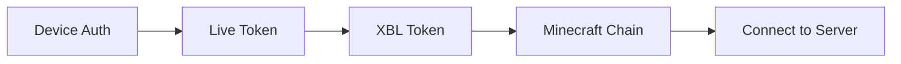

## Overview

Gophertunnel implements the complete authentication chain for Minecraft Bedrock Edition, which involves:

1. **Microsoft Live Connect** - OAuth2 device authentication
2. **Xbox Live (XBL)** - Platform-specific Xbox authentication  
3. **Minecraft Services** - Obtaining a Minecraft JWT chain

All authentication code is located in the `minecraft/auth/` package.

## Authentication Flow



## Microsoft Live Connect

The first step is obtaining a Microsoft Live Connect access token using device authentication.

### Device Authentication

Device auth allows users to authenticate by visiting a URL and entering a code:

```go
import "github.com/sandertv/gophertunnel/minecraft/auth"

// Request a token using device auth
// This prints the URL and code to stdout
token, err := auth.RequestLiveToken()
if err != nil {
    panic(err)
}
```

Output:
```
Authenticate at https://www.microsoft.com/link using the code ABC12345.
Authentication successful.
```

### Custom Output Writer

You can redirect the authentication messages to any `io.Writer`:

```go
import (
    "bytes"
    "github.com/sandertv/gophertunnel/minecraft/auth"
)

var buf bytes.Buffer
token, err := auth.RequestLiveTokenWriter(&buf)
if err != nil {
    panic(err)
}

fmt.Println(buf.String()) // Contains auth instructions
```

### Token Sources

For automatic token management and refresh:

```go
import "github.com/sandertv/gophertunnel/minecraft/auth"

// Token source that handles device auth and automatic refresh
tokenSource := auth.TokenSource

// Get a token (cached and auto-refreshed)
token, err := tokenSource.Token()
if err != nil {
    panic(err)
}
```

### Refresh Tokens

If you already have a token and want to refresh it:

```go
// Create a token source from an existing token
tokenSource := auth.RefreshTokenSource(existingToken)

// Token will be automatically refreshed when expired
token, err := tokenSource.Token()
```

<Note>
  Always use `auth.RefreshTokenSource` instead of `oauth2.ReuseTokenSource` because the latter doesn't refresh with the correct scopes required by Xbox Live.
</Note>

## Xbox Live Authentication

### XBLToken Structure

The `XBLToken` holds Xbox Live authorization info:

```go
type XBLToken struct {
    AuthorizationToken struct {
        DisplayClaims struct {
            UserInfo []struct {
                GamerTag string `json:"gtg"` // Only on "xboxlive.com" relying party
                XUID     string `json:"xid"` // Only on "xboxlive.com" relying party  
                UserHash string `json:"uhs"`
            } `json:"xui"`
        }
        IssueInstant time.Time
        NotAfter     time.Time
        Token        string
    }
}
```

### Requesting XBL Tokens

Request an XBL token using a Live Connect token:

```go
import (
    "context"
    "github.com/sandertv/gophertunnel/minecraft/auth"
)

liveToken, _ := auth.RequestLiveToken()

// Request XBL token for Minecraft multiplayer
xblToken, err := auth.RequestXBLToken(
    context.Background(),
    liveToken,
    "https://multiplayer.minecraft.net/",
)
if err != nil {
    panic(err)
}

// Check if token is valid
if !xblToken.Valid() {
    panic("XBL token expired")
}
```

### Platform Configurations

Gophertunnel includes pre-configured settings for different platforms:

```go
import "github.com/sandertv/gophertunnel/minecraft/auth"

// Android (default)
auth.AndroidConfig.RequestXBLToken(ctx, liveToken, relyingParty)

// iOS
auth.IOSConfig.RequestXBLToken(ctx, liveToken, relyingParty)

// Windows
auth.Win32Config.RequestXBLToken(ctx, liveToken, relyingParty)

// Nintendo Switch
auth.NintendoConfig.RequestXBLToken(ctx, liveToken, relyingParty)

// PlayStation
auth.PlayStationConfig.RequestXBLToken(ctx, liveToken, relyingParty)
```

<ParamField path="AndroidConfig" type="Config">
  Configuration for Minecraft: Bedrock Edition on Android. ClientID: `0000000048183522`
</ParamField>

<ParamField path="IOSConfig" type="Config">
  Configuration for iOS devices. ClientID: `000000004c17c01a`
</ParamField>

<ParamField path="Win32Config" type="Config">
  Configuration for Windows devices. ClientID: `0000000040159362`
</ParamField>

<ParamField path="NintendoConfig" type="Config">
  Configuration for Nintendo Switch. ClientID: `00000000441cc96b`
</ParamField>

<ParamField path="PlayStationConfig" type="Config">
  Configuration for PlayStation devices. ClientID: `000000004827c78e`
</ParamField>

### XBL Token Caching

To avoid rate limiting, cache device and XBL tokens:

```go
import "github.com/sandertv/gophertunnel/minecraft/auth"

// Create a token cache
cache := auth.AndroidConfig.NewTokenCache()

// Add cache to context
ctx := auth.WithXBLTokenCache(context.Background(), cache)

// Request token (will be cached)
xblToken, err := auth.AndroidConfig.RequestXBLToken(
    ctx,
    liveToken,
    "https://multiplayer.minecraft.net/",
)

// Subsequent requests use cached token if still valid
xblToken2, err := auth.AndroidConfig.RequestXBLToken(
    ctx,
    liveToken,
    "https://multiplayer.minecraft.net/",
)
```

<Info>
  Token caches are safe for concurrent use and automatically handle token expiration.
</Info>

## Minecraft Chain Authentication

The final step is requesting a Minecraft JWT chain:

```go
import (
    "crypto/ecdsa"
    "crypto/elliptic"
    "crypto/rand"
    "github.com/sandertv/gophertunnel/minecraft/auth"
)

// Generate ECDSA key for encryption
key, _ := ecdsa.GenerateKey(elliptic.P384(), rand.Reader)

// Request Minecraft chain
chain, err := auth.RequestMinecraftChain(context.Background(), xblToken, key)
if err != nil {
    panic(err)
}

// chain is a JSON string containing the JWT chain
```

<Warning>
  The ECDSA private key must be saved and used later for packet encryption/decryption.
</Warning>

## Complete Authentication Example

Putting it all together:

```go
package main

import (
    "context"
    "crypto/ecdsa"
    "crypto/elliptic"
    "crypto/rand"
    "fmt"
    
    "github.com/sandertv/gophertunnel/minecraft"
    "github.com/sandertv/gophertunnel/minecraft/auth"
)

func main() {
    // Step 1: Get Live Connect token
    tokenSource := auth.TokenSource
    
    // Step 2: Configure dialer with token source
    dialer := minecraft.Dialer{
        TokenSource: tokenSource,
    }
    
    // Step 3: Connect to server (auth happens automatically)
    conn, err := dialer.Dial("raknet", "example.com:19132")
    if err != nil {
        panic(err)
    }
    defer conn.Close()
    
    // Check authentication status
    if conn.Authenticated() {
        identity := conn.IdentityData()
        fmt.Printf("Authenticated as %s (XUID: %s)\n", 
            identity.DisplayName, identity.XUID)
    }
}
```

## Server-Side Authentication

Servers can require Xbox Live authentication:

```go
import "github.com/sandertv/gophertunnel/minecraft"

config := minecraft.ListenConfig{
    AuthenticationDisabled: false, // Require authentication
}

listener, err := config.Listen("raknet", "0.0.0.0:19132")
if err != nil {
    panic(err)
}

for {
    conn, err := listener.Accept()
    if err != nil {
        panic(err)
    }
    
    c := conn.(*minecraft.Conn)
    
    // Check if player is authenticated
    if !c.Authenticated() {
        listener.Disconnect(c, "Xbox Live authentication required")
        continue
    }
    
    identity := c.IdentityData()
    fmt.Printf("Player %s (XUID: %s) connected\n",
        identity.DisplayName, identity.XUID)
    
    go handleConnection(c)
}
```

<Note>
  When `AuthenticationDisabled` is `false`, the server uses OpenID Connect to verify the multiplayer token in the login packet.
</Note>

## Error Handling

### Xbox Live Error Codes

Xbox Live may return specific error codes:

```go
xblToken, err := auth.RequestXBLToken(ctx, liveToken, relyingParty)
if err != nil {
    // Error messages are automatically parsed from Xbox error codes:
    // - 2148916227: Account banned
    // - 2148916229: Parental restrictions
    // - 2148916233: No Xbox profile
    // - 2148916234: Terms of Service not accepted
    // - 2148916235: Region not authorized
    // - 2148916236: Proof of age required
    // - 2148916237: Playtime limit reached
    // - 2148916238: Under 18, needs family account
    fmt.Printf("Authentication failed: %v\n", err)
}
```

### Token Expiration

```go
// Check if Live Connect token is valid
if !liveToken.Valid() {
    // Token expired, refresh it
    newToken, err := tokenSource.Token()
}

// Check if XBL token is valid
if !xblToken.Valid() {
    // Request a new XBL token
    xblToken, err = auth.RequestXBLToken(ctx, liveToken, relyingParty)
}
```

## Offline Mode

To connect without authentication:

```go
dialer := minecraft.Dialer{
    TokenSource: nil, // No authentication
    IdentityData: login.IdentityData{
        DisplayName: "Steve",
        Identity:    "unique-uuid",
    },
}

conn, err := dialer.Dial("raknet", "example.com:19132")
```

<Warning>
  Many servers require Xbox Live authentication and will reject unauthenticated connections.
</Warning>
